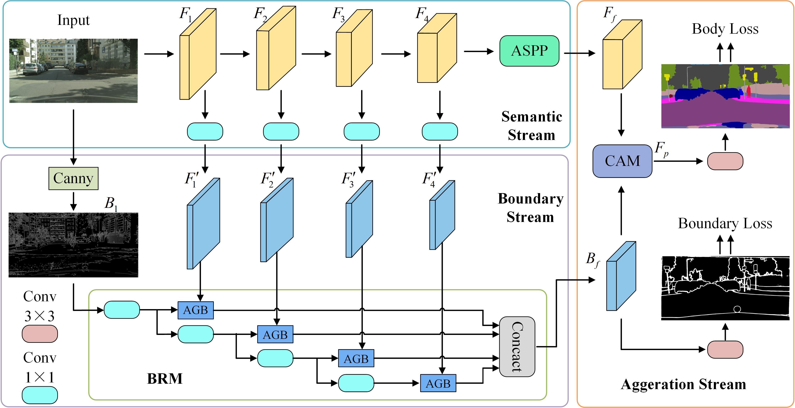

# BASeg
The code of paper "BASeg: Boundary Aware Semantic Segmentation for Autonomous Driving"

### Introduction
This repository is a official PyTorch implementation for semantic segmentation. 



### Usage
1. Requirement:
   - Hardware: 4-8 GPUs (better with >=11G GPU memory)
   - Software: PyTorch>=1.1.0, Python3, [tensorboardX](https://github.com/lanpa/tensorboardX)

2. Clone the repository:
   ```shell
   git clone git@github.com:Lature-Yang/BASeg.git
   ```

3. Data preparation
   - Download related datasets ([ADE20K](http://groups.csail.mit.edu/vision/datasets/ADE20K/), [Cityscapes](https://www.cityscapes-dataset.com/), [CamVid](https://github.com/lih627/CamVid)) and symlink the paths to them as follows (you can alternatively modify the relevant paths specified in folder `config`):

   - To boost the slow speed of the training, you're supposed to prepare the boundary ground truth from [here](https://drive.google.com/drive/folders/1wihXt4chb8Tq5lvPCtT1HXkDqWcyCyoc?usp=sharing).

   - The directory structure is the standard layout for the torchvision
     ```
     /Dataset/
       ADE20K/
         Scene-Parsing/
            ADEChallengeData2016/
              images/
              bound/
              annotations/
       Cityscapes/
         bound/
         gtFine/
         leftImg8bit/
       CamVid/
         bound/
         CamVid_Label/
         CamVid_RGB/
     ```

4. Train:
   - Download ImageNet pre-trained [models](https://drive.google.com/open?id=15wx9vOM0euyizq-M1uINgN0_wjVRf9J3) and put them under folder `model` for weight initialization. 
   
   - ADE20K:
     ```shell
     sh tool/trainade.sh ade20k baseg101
     ```
   - Cityscapes:
     ```shell
     sh tool/traincityscapes.sh cityscapes baseg101
     ```
   - CamVid:
     ```shell
     sh tool/traincamvid.sh camvid baseg101
     ```

5. Test:
   - Download trained segmentation [models](https://drive.google.com/drive/folders/1u63PwLEDbvURM_THT99X6UNuQPSP0I3h?usp=sharing) and put them under folder specified in config or modify the specified paths.

   - For full testing (get listed performance):
   - Validation on ADE20K
     ```shell
     sh tool/testade.sh ade20k baseg101
     ```
   - Test on Cityscapes
     ```shell
     sh tool/testcityscapes.sh cityscapes baseg101
     ```
   - Validation on CamVid
     ```shell
     sh tool/testcamvid.sh camvid baseg101
     ```

### Citation
If you find the code or trained models useful, please consider citing:
```
@InProceedings{zhao2018psanet,
  title={{BASeg}: Boundary Aware Semantic Segmentation for Autonomous Driving},
  author={Xiao, Zhao, and Zhang},
  booktitle={ECCV},
  month={November},
  year={2022}
}
```

### Acknowledgement
The code is from the first author of semseg.
=======

