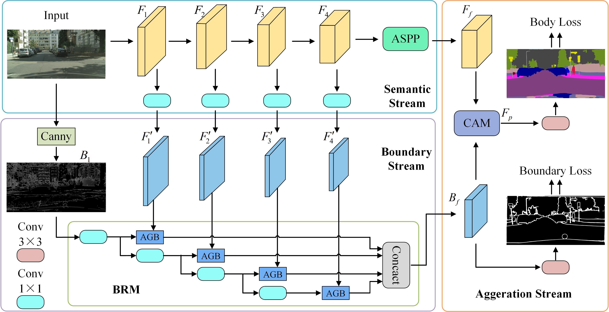

# BASeg: Boundary Aware Semantic Segmentation for Autonomous Driving
This repository contains the official code release of [**BASeg: Boundary Aware Semantic Segmentation for Autonomous Driving**](https://doi.org/10.1016/j.neunet.2022.10.034) (NN 2023). 

## 1. Introduction
In this paper, we present a Boundary Aware Network (BASeg) for semantic segmentation by exploiting boundary information as a significant cue to guide context aggregation.



## 2. Usage
### 2.1. Requirement:
   - Hardware: 4-8 GPUs (better with >=11G GPU memory)
   - Software: PyTorch>=1.1.0, Python3, [tensorboardX](https://github.com/lanpa/tensorboardX)

### 2.2. Clone the repository:
   ```
   git clone git@github.com:YangParky/BASeg.git
   ```

### 2.3. Data preparation
   - Download related datasets ([ADE20K](http://groups.csail.mit.edu/vision/datasets/ADE20K/), [Cityscapes](https://www.cityscapes-dataset.com/), [CamVid](https://github.com/lih627/CamVid)) and symlink the paths to them as follows (you can alternatively modify the relevant paths specified in folder `config`). To boost the slow speed of the training, you're supposed to prepare the boundary ground truth from [here](https://drive.google.com/drive/folders/1wihXt4chb8Tq5lvPCtT1HXkDqWcyCyoc?usp=sharing).
   - The directory structure is the standard layout for the torchvision
     ```
     /Dataset/
       ADE20K/
         Scene-Parsing/
            ADEChallengeData2016/
              images/
              bound/
              annotations/
       Cityscapes/
         bound/
         gtFine/
         leftImg8bit/
       CamVid/
         bound/
         CamVid_Label/
         CamVid_RGB/
     /Model
     /Project
       /BASeg/
     ```

### 2.4. Train:
   - Download ImageNet pre-trained [models](https://drive.google.com/open?id=15wx9vOM0euyizq-M1uINgN0_wjVRf9J3) and put them under folder `Model` for weight initialization. 
   - For full traning:
     ADE20K:
     ```
     sh tools/trainade.sh ade20k baseg101
     ```
     
     Cityscapes:
     ```
     sh tools/traincityscapes.sh cityscapes baseg101
     ```
     
     CamVid:
     ```
     sh tools/traincamvid.sh camvid baseg101
     ```

### 2.5. Test:
   - Download trained segmentation [models](https://drive.google.com/drive/folders/1u63PwLEDbvURM_THT99X6UNuQPSP0I3h?usp=sharing) and put them under folder specified in config or modify the specified paths.
   - For full testing (get listed performance):
     Validation on ADE20K
     ```
     sh tools/testade.sh ade20k baseg101
     ```
     
   - Test on Cityscapes
     ```
     sh tools/testcityscapes.sh cityscapes baseg101
     ```
     
   - Validation on CamVid
     ```
     sh tools/testcamvid.sh camvid baseg101
     ```

   - For boundary evaluation:
     Evaluation on boundary F1_score
     ```
     python util/f_boundary.py
     ```
     
   - Evaluation on interior F1_score
     ```
     python util/f_interior.py
     ```

## Citation
If you find the code or trained models useful, please consider citing:
```
@article{xiao2023baseg,
  title={BASeg: Boundary aware semantic segmentation for autonomous driving},
  author={Xiao, Xiaoyang and Zhao, Yuqian and Zhang, Fan and Luo, Biao and Yu, Lingli and Chen, Baifan and Yang, Chunhua},
  journal={Neural Networks},
  volume={157},
  pages={460--470},
  year={2023},
  publisher={Elsevier}
}
```

## Acknowledgement
The code is from the first author of semseg.

## License
This repository is released under MIT License.
